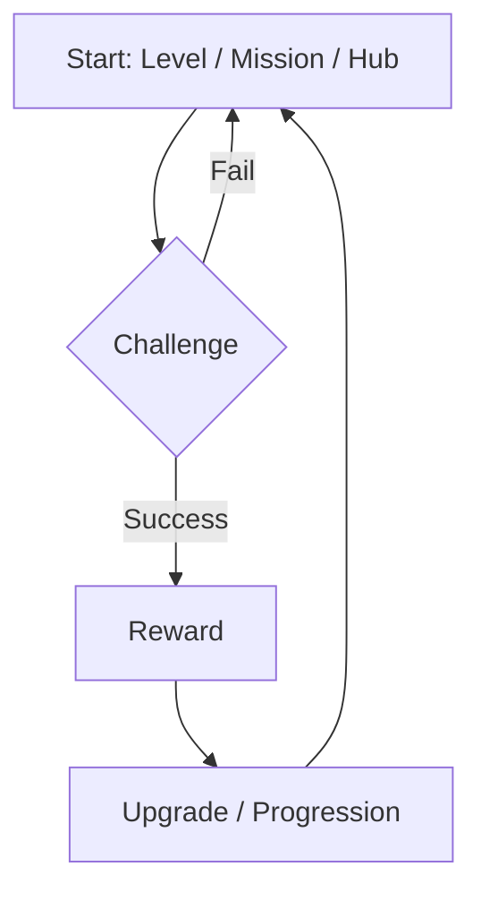

# Design notes

Made out of need and lack for a handy, short but descriptive source of info on a game project. Perfect for planning out jam games and smaller game development projects.

**Note:** This is **NOT** a full Game Design Document (GDD). This is a lightweight, living document meant to track the *current* state of vision for a game. Detailed spreadsheets, script files, and dialogue trees live elsewhere. **Keep it short. Keep it enjoyable to read!**

**Template last updated:** 2025-12-09

---

## 📑 Table of Contents

1. [[#Working title]]
2. [[#Overview & pitch]]
3. [[#Gameplay]]
4. [[#Design & aesthetics]]
5. [[#Narrative & world(building)]]
6. [[#Notes and/or random ideas]]
7. [[#Good Practices]]

---

## Working title

## Overview & pitch

### Pitch

**One sentence:** [Insert a catchy "elevator pitch" here. e.g., "Mario meets Dark Souls."]

### Summary

A brief description of the game. What is the player doing? What is the goal?

### Tech details

- **Demographics:** [e.g., Train enthusiasts]
- **Genre/tags:** [e.g., Metroidvania, FPS, Cosy]
- **Engine:** [e.g., Godot]
- **Comparable titles / inspirations:** [e.g., Blackthorne (1994)]

## Gameplay

### Core loop

The cycle the player repeats minute-to-minute.

### Core systems (and mechanics)

  - `Movement`: [e.g., Double jump, dash, wall-climb]
  - `Combat`: [e.g., Turn-based, real-time, projectile logic]
  - `Progression`: [e.g., Skill trees, unlocking levels]

## Design & aesthetics

### UI / UX

  - **HUD:** [What is on screen? Health bar? Ammo?]
  - **Interfaces:** [Diagetic or not]

### Video / Visuals

  - **Art style:** [e.g., Low-poly, Pixel art 16-bit]
  - **Perspective:** [e.g., Top-down, First-person]

### Audio

  - **Music:** [Genre, adaptive music layers]
  - **SFX:** [Key sound effects needed, ambient nature]

## Narrative & world(building)

### Main Theme

What is the "soul" of the game? (e.g., "Family," "Hopecore")

### Worldbuilding

  - **Setting:** [e.g., Cyberpunk Tokyo, 1920s Noir, Fantasy Forest]
  - **Lore:** [Brief history or rules of the world]
  - **Characters:** [Protagonist motivation, antagonist goal, is there supporting cast?]

## Notes and/or random ideas

*Ideas that are cool but not yet verified or implemented. Keep them here so they don't clutter the main design.*

  - [ ] Maybe add a fishing minigame?
  - [ ] DLC idea: Space levels?
  - [ ] Mechanic idea: Time rewinding (might be too expensive to code)

---

## Good Practices

### Guidelines

  - **Don't get burned out!** Writting a long doc is tiring, sometimes prevents you from the core fun of the game dev!
  - Use Mermaid diagrams, like in [[#Core loop]], for logic flows.
  - **Kill your darlings.** If a feature isn't fun in the prototype, move it to [[#Notes and/or random ideas]].
  - **Update if you need.** Design might change after every playtest (and that's totally ok).
